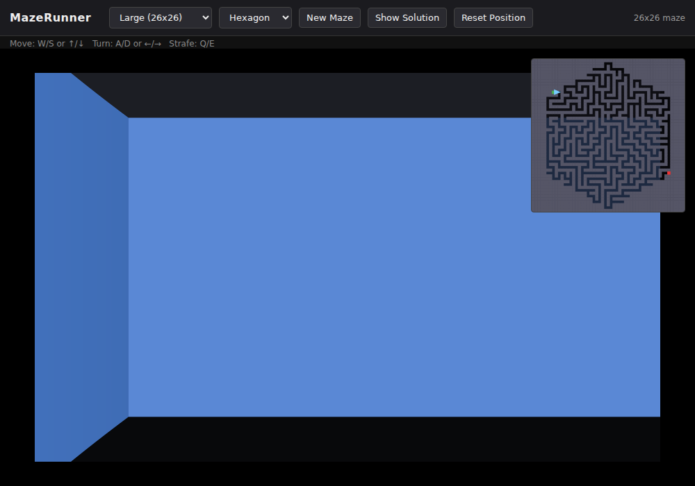

# MazeRunner

A small, dependency-free web maze generator, solver, and first-person walker.

**[▶ Try it live](https://otisranson.github.io/MazeRunner/)** -- runs entirely client-side
(plain HTML/JS/canvas, no backend), so the GitHub Pages deploy is the real thing, not a demo.

Or open `index.html` in a browser directly — no build step, no server, no npm.

- **Generator**: recursive-backtracker algorithm, four size presets
- **Shape**: Square, Circle, Triangle, or a regular Pentagon through Decagon — the maze is carved
  to fit any of them, with entrance/exit placed at opposite corners of the shape
- **Intensity** (1–10): a difficulty slider independent of size. A recursive-backtracker maze
  is a spanning tree — exactly one route between any two cells, maximizing dead ends. Lower
  intensity "braids" that tree, knocking down walls at some fraction of dead ends to punch
  shortcuts back into the path (a lower-intensity maze has fewer, more forgiving dead ends;
  intensity 10 is the unbraided perfect maze — one forced path, no shortcuts). The stats bar
  shows the live dead-end count as a rough difficulty readout
- **Solver**: BFS shortest path, shown as an overlay on the minimap via "Show Solution"
- **Wall color**: pick any color for the walls, or toggle **Psychedelic Mode** for animated,
  flowing rainbow walls (overlapping sine waves in the wall's hit coordinates + time, so the
  color moves like fluid across the surface rather than just flashing)
- **ASCII Mode**: renders the walls as shaded ASCII characters (`@%#*+=-:. `) instead of solid
  color, density-mapped to distance like real ASCII art — combines with wall color/Psychedelic
  Mode too, since it's just the same per-column shading rendered as text instead of a fill
- **First-person view**: a Wolfenstein-style DDA raycaster rendered on `<canvas>`
  - Move: `W`/`S` or `↑`/`↓`
  - Turn: `A`/`D` or `←`/`→`
  - Strafe: `Q`/`E`
- Minimap inset shows the full maze, your position/heading, start (green) and exit (red)
- Reaching the exit shows a win banner with elapsed time
