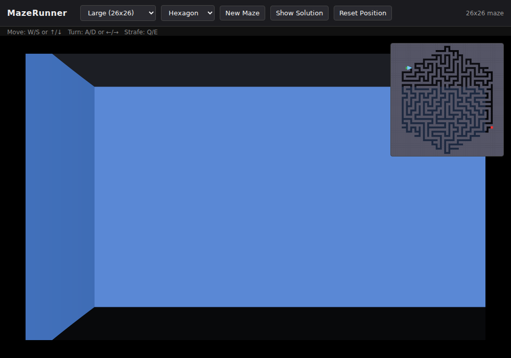

# MazeRunner

A small, dependency-free web maze generator, solver, and first-person walker.

**[▶ Try it live](https://otisranson.github.io/MazeRunner/)** -- runs entirely client-side
(plain HTML/JS/canvas, no backend), so the GitHub Pages deploy is the real thing, not a demo.

Or open `index.html` in a browser directly — no build step, no server, no npm.



- **Generator**: recursive-backtracker algorithm, four size presets
- **Shape**: Square, Circle, Triangle, or a regular Pentagon through Decagon — the maze is carved
  to fit any of them, with entrance/exit placed at opposite corners of the shape
- **Intensity** (1–10): a difficulty slider independent of size. A recursive-backtracker maze
  is a spanning tree — exactly one route between any two cells, maximizing dead ends. Lower
  intensity "braids" that tree, knocking down walls at some fraction of dead ends to punch
  shortcuts back into the path (a lower-intensity maze has fewer, more forgiving dead ends;
  intensity 10 is the unbraided perfect maze — one forced path, no shortcuts). The stats bar
  shows the live dead-end count as a rough difficulty readout
- **Apply Settings**: Size, Shape, and Intensity changes don't regenerate the maze right away —
  adjust as many as you like, then hit **Apply Settings** (which lights up amber as a reminder
  something's pending) to commit them all at once. **New Maze** re-rolls immediately using
  whatever's currently applied
- **Solver**: BFS shortest path, shown as an overlay via "Show Solution" (on the minimap in
  first-person view, or traced directly on the page in Top-Down Mode)
- **Wall color**: pick any color for the walls, or toggle **Psychedelic Mode** for animated,
  flowing rainbow walls (overlapping sine waves in the wall's hit coordinates + time, so the
  color moves like fluid across the surface rather than just flashing)
- **Top-Down Mode**: ditches the 3D view entirely for a traditional maze-book-style overhead
  page — the whole maze drawn at once with solid walls, filling the screen, start/exit shown as
  green/red circles, and your position as a small triangular arrow that rotates smoothly to your
  exact heading and moves across the static page. No scrolling, no fog of war — the whole maze
  is visible at once, like a printed puzzle. Same WASD/touch controls, just a different way to
  see the maze; combine with Show Solution to trace the path on the page. The minimap hides
  itself in this mode since the main view already shows the full map
- **First-person view**: a Wolfenstein-style DDA raycaster rendered on `<canvas>`
  - Move: `W`/`S` or `↑`/`↓`
  - Turn: `A`/`D` or `←`/`→`
  - Strafe: `Q`/`E`
- Minimap inset (first-person view only) shows the full maze, your position/heading as a
  rotating arrow, and start (green circle)/exit (red circle) — the same marker shapes Top-Down
  Mode uses, so every view draws the maze's landmarks the same way
- Reaching the exit shows a win banner with elapsed time
- **Mobile friendly**: on a touchscreen, an on-screen D-pad (move/turn) appears bottom-left and
  the raycast view/minimap resize to fill the actual screen instead of a fixed desktop size; the
  toolbar becomes a single scrollable row with larger tap targets so every option (size, shape,
  intensity, color, mode toggles) stays reachable on a small screen

## How it works: the maze algorithms

Everything below lives in the one `index.html` file — no libraries, just the raw algorithms.
Each piece is tagged against the discipline it actually belongs to, in the spirit of (and using
the same vocabulary as) my private [Organon](https://github.com/otisranson/Organon) index —
the instrument built for mapping applied work back to its formal foundations rather than
describing code as if it invented the math underneath it.

**Generation — recursive backtracker.** *Organon: Graph theory, Combinatorics.* The maze is
carved out of a grid of cells that all start fully walled in. Starting from a seed cell, the
algorithm maintains a stack: at each step it looks at the current cell's unvisited neighbors,
and if any exist, picks one at random, knocks down the wall between them, marks it visited, and
pushes it onto the stack; if none exist, it pops the stack and backtracks. This is a randomized
depth-first search, and because every cell is visited exactly once via exactly one knocked-down
wall, the result is a **spanning tree** of the grid graph — connected, with exactly `cells − 1`
open walls and no cycles. That spanning-tree property is what guarantees a "perfect maze":
there's exactly one path between any two cells, and dead ends are maximized (every leaf of the
tree is a dead end).

**Shape carving — regular polygon as an intersection of half-planes.** *Organon: Computational
geometry.* Non-square shapes (circle, triangle, pentagon…decagon) work by testing which grid
cells fall inside a regular k-gon inscribed in the grid, before generation ever runs. Each
cell's center is normalized to `(cx, cy)` in `[-1, 1]²`. A regular k-sided polygon with
circumradius 1 has apothem (inradius) `a = cos(π / k)`, and its interior is exactly the
intersection of k half-planes, one per edge,
each facing outward at angle `φᵢ = -π/2 + (i + 0.5) · (2π / k)`. A point is inside the polygon
only if, for every edge, its projection onto that edge's outward normal doesn't exceed the
apothem:

```
cx·cos(φᵢ) + cy·sin(φᵢ) ≤ a   for all i = 0..k-1
```

(A circle is the same idea taken to the limit: `cx² + cy² ≤ 1`.) Whatever cells pass the test
get flood-filled from the grid center to keep only the single connected blob — this is what
stops the polygon's corners from discretizing into stray, unreachable 1-cell islands.

**Difficulty — Intensity as a braid-probability curve.** *Organon: Probability theory.* A
perfect maze (no cycles) is also the *hardest possible* maze for a given size, since every wrong
turn is a dead end with no shortcut back. The Intensity slider controls **braiding**: after
generation, every dead-end cell (degree 1 in the spanning tree) gets an independent Bernoulli
trial — knock down one more wall to a neighboring cell, injecting a cycle as a shortcut back
into the path, or don't. The per-cell success probability is a straight linear function of the
slider:

```
braidChance(intensity) = 0.75 · (10 − intensity) / 9
```

At intensity 10, `braidChance = 0` — no braiding, the untouched perfect maze. At intensity 1,
`braidChance = 0.75` — most dead ends get knocked open, loosening the maze into something far
more forgiving. The stats bar's live dead-end count is literally just counting degree-1 cells
after braiding, so it tracks this directly.

**Entrance & exit — geometric extremes, not graph diameter.** *Organon: Graph theory.* The
obvious "hardest start/exit" choice is the two endpoints of the spanning tree's longest path
(its graph diameter, found via a double-BFS). That was tried and dropped: a recursive
backtracker's DFS root is very often left at degree 1 (a documented property of the algorithm,
not a bug), which kept dragging one
diameter endpoint back to the generation seed near the shape's center, regardless of maze size
or shape. Start/exit are instead picked geometrically — the two active cells minimizing and
maximizing `x + y` — i.e. the opposite corners of the shape's bounding box. For a square this
reproduces the classic top-left-to-bottom-right corners; for every other shape it gives a
boundary-to-boundary traversal with no dependency on generation-order artifacts.

**Solver — plain BFS.** *Organon: Graph theory, Algorithms.* Shortest path from start to exit is
an unweighted-graph breadth-first search over the post-braiding maze graph, which may now
contain cycles — BFS still finds the shortest route in edge count regardless. This same path
backs both "Show Solution" and the player's initial facing direction (aimed at the first
solution step).

**First-person rendering — DDA raycasting with fisheye correction.** *Organon: Computational
geometry.* The 3D view is a classic Wolfenstein-style raycaster: for each screen column, a ray
is cast from the player across a 60° field of view using **Digital Differential Analysis** —
stepping the ray one grid line at a time along whichever axis (x or y) reaches its next
boundary first, rather than marching in small
fixed increments, so wall collisions are found in O(1) steps per grid cell. The naive straight-
line ray distance would bulge walls outward toward the screen edges ("fisheye"); the fix is to
use the *perpendicular* distance to the player's facing direction instead of the Euclidean ray
length — `corrected = dist · cos(rayAngle − player.angle)` — and project wall height as
`canvas height / corrected`, so walls directly ahead and walls at the edge of the FOV at the
same true distance render at the same height.

**Psychedelic Mode — a flowing hue field.** *Not really an Organon entry* — this one's just
applied trigonometry with no deeper theoretical foundation to cite, which is worth saying
plainly rather than dressing it up. Wall color becomes `hsl(hue, 90%, light)` where `hue` is
driven by four overlapping sine waves sampled at the wall's actual hit coordinates (not just its
grid cell) plus elapsed time — so the color moves continuously across a wall's surface like
fluid, rather than flashing per-tile.
